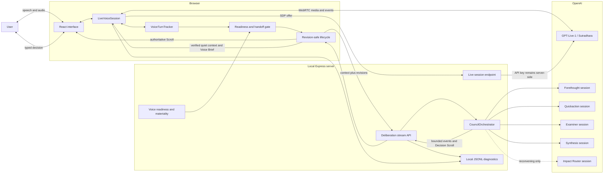
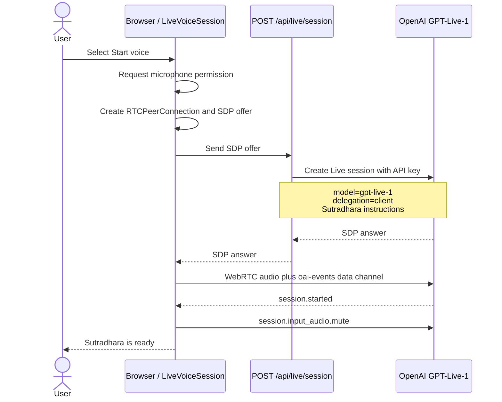
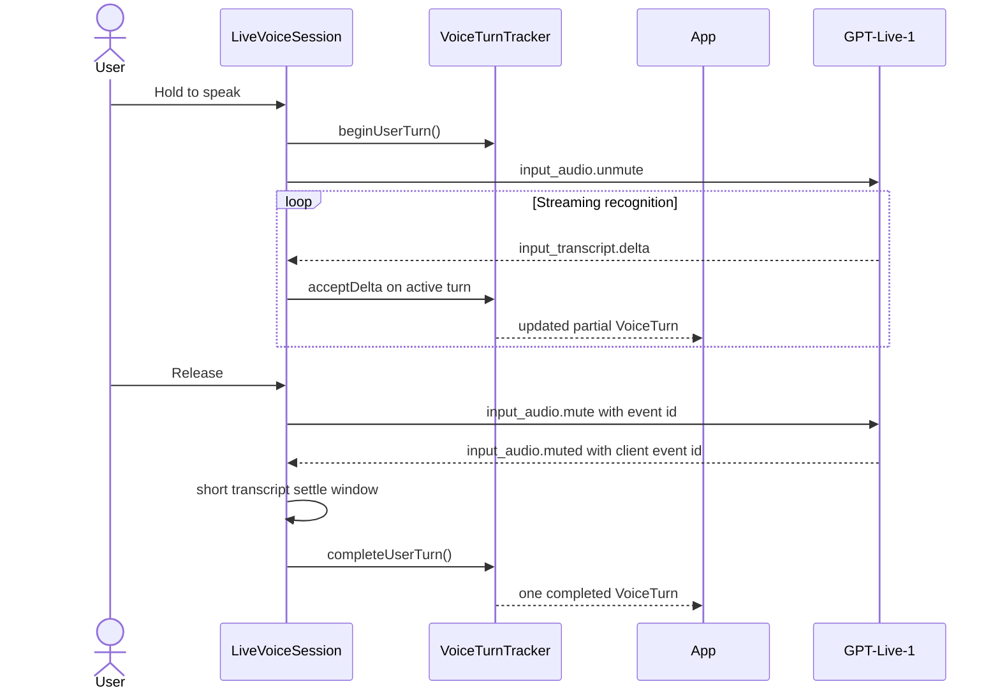
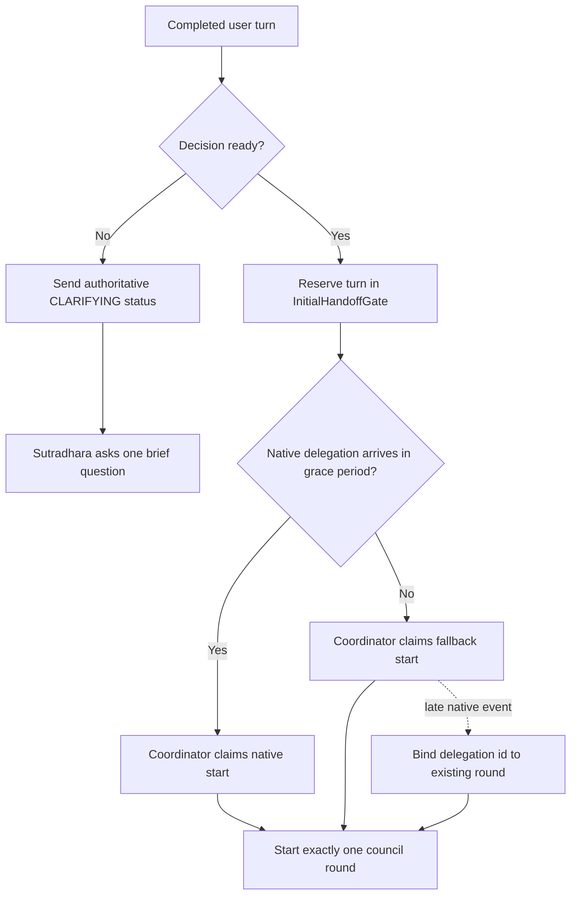
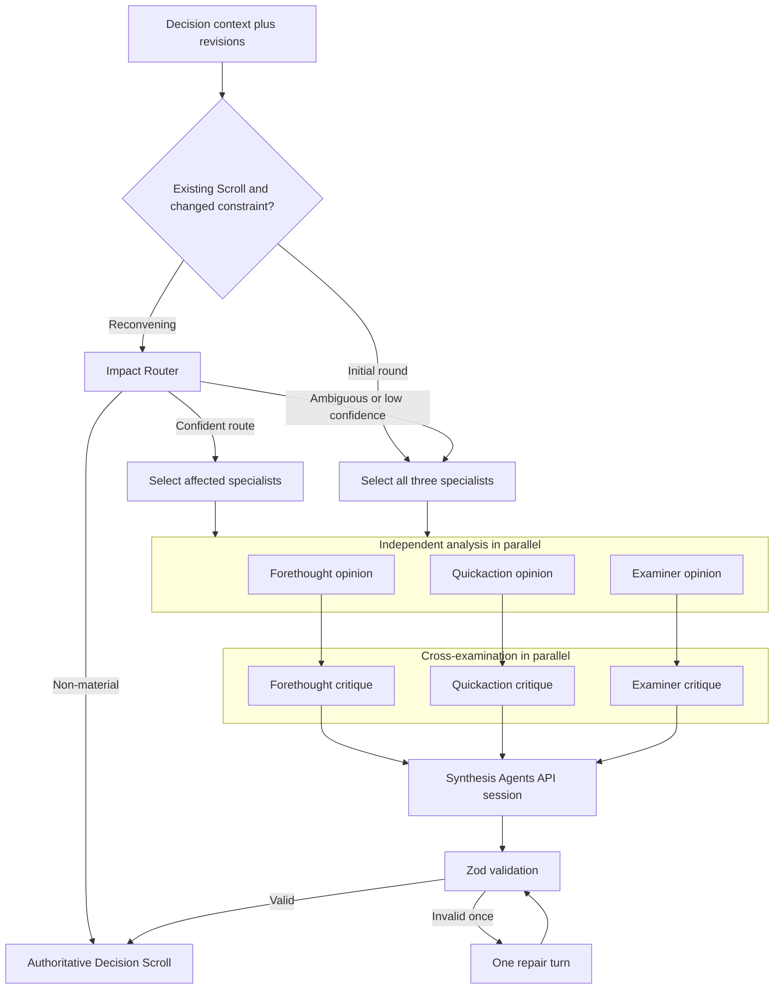
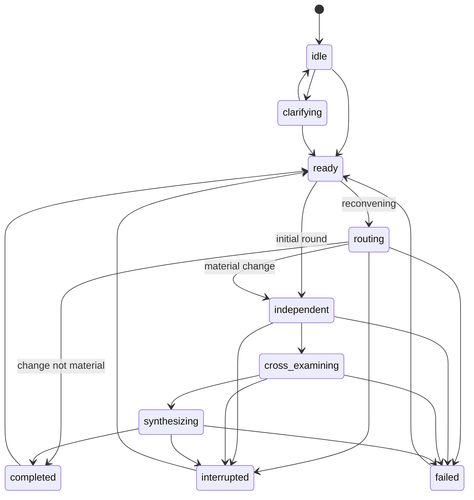
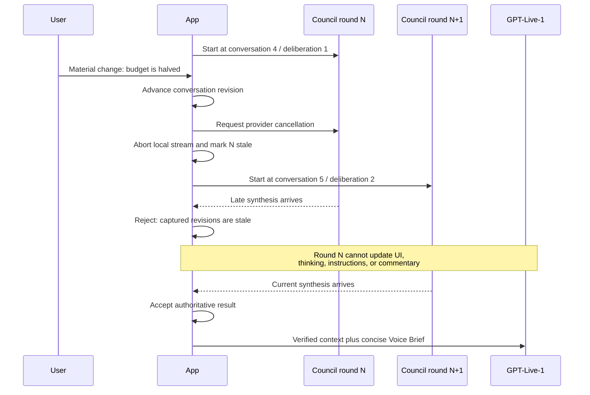
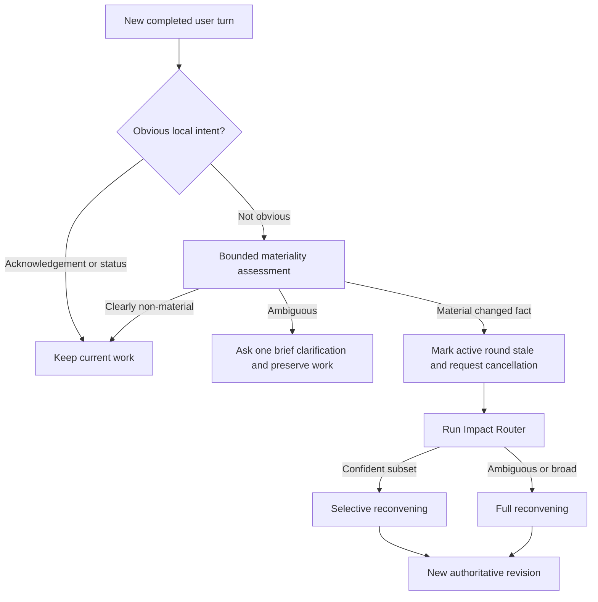
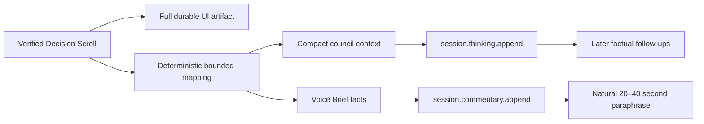

# Sagacity Syndicate Architecture

Sagacity Syndicate is a local-first, voice-capable decision aid. It combines two OpenAI systems without giving them overlapping authority:

- **GPT-Live-1** is Sutradhara, the low-latency conversational moderator.
- **OpenAI Agents API sessions** run the decision council and return bounded, validated artifacts.

The central design rule is simple: **conversation is not decision authority**. GPT-Live can clarify, delegate, report verified status, and explain a completed result. Only the council orchestration path can create or revise the Decision Scroll.

This document describes the implementation in this repository. The OpenAI protocol references were checked on 13 September 2026 against the official [GPT-Live client delegation guide](https://developers.openai.com/api/docs/guides/live-delegation?delegation-mode=client), [GPT-Live WebRTC guide](https://developers.openai.com/api/docs/guides/voice-webrtc?api=live), and [Agents API session reference](https://developers.openai.com/api/reference/typescript/resources/beta/subresources/agents/subresources/sessions/methods/create).

## 1. System at a glance



There are two application entry paths but only one council:

| Path | Intake | How deliberation starts | Result |
| --- | --- | --- | --- |
| Voice | GPT-Live conversation and completed `VoiceTurn` records | Native client delegation or an idempotent application fallback | Decision Scroll in the UI plus a short spoken briefing |
| Text | Decision Context form | User selects **Convene the council** | The same Decision Scroll schema in the UI |

## 2. Responsibility boundaries

### GPT-Live-1: conversational layer

GPT-Live runs over browser WebRTC. Sutradhara can:

- conduct a natural voice conversation;
- ask only the clarification needed to identify the decision;
- request client delegation;
- acknowledge authoritative application status;
- paraphrase a verified Voice Brief;
- answer follow-up questions from bounded, verified council context.

Sutradhara cannot:

- start backend work merely by saying it has done so;
- create, modify, or override a Decision Scroll;
- infer that synthesis succeeded before the application confirms it;
- expose raw agent output or private reasoning.

The server creates the Live session with `delegation: { type: "client" }`. Under the documented client-delegation model, the application chooses and runs the backend. A Live delegation event is therefore a handoff signal, not a council result.

### Council: decision layer

`CouncilOrchestrator` is the sole decision-production path. It:

1. establishes the current conversation and deliberation revisions;
2. runs the selected specialists independently and in parallel;
3. runs one cross-examination round in parallel;
4. synthesizes the bounded Decision Scroll;
5. emits state and result events;
6. rejects stale work before it can render or speak.

### React application: control plane

`client/App.tsx` joins the two layers. It owns product mode, completed-turn processing, readiness and materiality requests, native/fallback handoff coordination, captured revision checks, the current authoritative Scroll, and what verified context is appended to GPT-Live.

This is intentional. Spoken language is probabilistic; council state must be deterministic and inspectable.

## 3. GPT-Live connection and turn lifecycle

### WebRTC session establishment



The browser creates the peer connection, but the API key never enters browser JavaScript. The local server exchanges the SDP offer with OpenAI and returns only the transport answer.

### Why transcript deltas are not turns

`session.input_transcript.delta` and `session.output_transcript.delta` are streaming fragments. Rendering or processing each fragment as a new message would create duplicate transcript rows and, more seriously, could treat the tail of the delegating utterance as a new interruption.

The client instead maintains explicit turns:

```ts
type VoiceTurn = {
  id: string
  role: "user" | "sutradhara"
  text: string
  startedAt?: number
  completedAt?: number
  complete: boolean
}
```

For push-to-talk input, turn completion uses an event boundary rather than linguistic guessing:

1. pressing starts one user turn and unmutes Live input;
2. transcript deltas update that same turn;
3. releasing sends `session.input_audio.mute`;
4. the `session.input_audio.muted` acknowledgement establishes the audio boundary;
5. a short settle window accepts late transcript fragments;
6. the client emits one `turn.completed` event.

Assistant fragments are likewise merged, with a bounded inactivity window closing the visible Sutradhara turn.



## 4. Delegation: native signal plus safe fallback

GPT-Live client delegation and application readiness can race. The repository treats this as an exactly-once coordination problem.



The pieces are:

- `VoiceReadinessAssessor`: bounded server-side classification of `clarify` versus `convene`.
- `InitialHandoffGate`: allows only one unresolved initial handoff across successive turns.
- `VoiceDelegationCoordinator`: lets native delegation or fallback claim the start exactly once.
- `offset_ms` binding: associates a delegation with its causal transcript turn.

If native `session.delegation.created` does not arrive after the short grace period, the application fallback starts the same council API. If native delegation arrives later, it binds to that existing round instead of starting a second one. The causal turn is marked explicitly and can never cancel the work it initiated.

## 5. Council deliberation pipeline



Each specialist is a managed Agents API session configured with its own prompt and JSON Schema output format. `Promise.all` provides independent-stage and critique-stage concurrency. Cross-examination receives bounded opinions, not private chain-of-thought. Synthesis receives the validated opinions and critiques and is itself schema constrained.

Existing specialist sessions can continue on reconvening, preserving useful session context. Separate synthesis and routing sessions prevent the moderator from becoming a hidden fourth decision-maker.

## 6. Bounded contracts

All provider output is parsed and validated locally with Zod. The same Zod definitions generate the JSON Schemas supplied to Agents API sessions.

| Contract | Purpose | Important bounds |
| --- | --- | --- |
| `SpecialistOpinion` | Independent lens | 1–4 observations, up to 3 uncertainties, confidence 0–1 |
| `Critique` | Cross-examination | 1–2 targets, up to 2 agreements, 1–3 challenges, enumerated severity |
| `ImpactRoute` | Reconvening scope | Unique subset of 0–3 agents, enumerated preservable fields, confidence 0–1 |
| `DecisionScroll` | Authoritative result | Seven required fields, field-level character limits, confidence 0–1 |
| `VoiceBrief` | Facts for short speech | Five compact fields, no more than 120 words total |
| `VoiceInterruptionAssessment` | Materiality decision | Boolean materiality, normalized changed constraint when material, reason, confidence |
| `VoiceReadinessAssessment` | Clarify or convene | Enumerated action, no more than two missing facts, reason, confidence |

An invalid agent response receives one repair continuation. A second invalid response fails visibly. No schema contains a chain-of-thought field.

## 7. State model and UI projections

The council state machine controls permitted orchestration transitions:



The UI presents four higher-level product modes:

| Product mode | Visual priority | Council phase examples |
| --- | --- | --- |
| Conversation | Sutradhara, voice control, transcript, optional context | `idle`, `clarifying`, `ready` |
| Deliberating | Phase headline and three agent cards | `independent`, `cross_examining`, `synthesizing` |
| Completed | Decision headline, confidence, compact views, expandable full Scroll | `completed` |
| Reconvening | Changed fact, rerun mode, current agent progress; prior Scroll preserved | `routing` through `synthesizing` |

Agent cards are projections of real orchestration events: `waiting`, `thinking`, `challenging`, `done`, or `error`. They are not decorative timers.

## 8. Revisions, cancellation, and stale-result safety

Two counters model different kinds of change:

- `conversationRevision` advances for each completed user turn or accepted text-context change.
- `deliberationRevision` advances only when a council run starts.

Every round captures both. A result is eligible to render, become quiet Live context, or be spoken only if both captured revisions are still current.



Provider cancellation is an optimization, not the safety boundary. Late work remains harmless because current-revision checks occur before every user-visible or Live-visible result path.

## 9. Interruption and reconvening

A completed turn that occurs after delegation is not automatically a cancellation request.



Examples:

- “Okay” and “What are they doing?” are non-material.
- “My budget is ₹8 lakh, not ₹20 lakh” is material.
- “That may not work” is ambiguous and should not destroy active work until clarified.

After completion, ordinary questions such as “Why?” reuse the verified Scroll. New material facts take the reconvening path. The prior Scroll stays visible until the new synthesis passes revision and schema checks.

## 10. Decision Scroll versus Voice Brief

The two outputs serve different purposes but do not create two sources of truth.



The **Decision Scroll** contains the full recommendation, rationale, three specialist takeaways, reconvening trigger, and confidence. It is the authoritative artifact.

The **Voice Brief** is deterministically derived from that verified Scroll. It carries only the recommendation, main reason, key tension, immediate next step, and optional trigger. GPT-Live receives facts and delivery instructions, then paraphrases naturally; the application does not prewrite a polished monologue.

Channel use is deliberate:

- `session.thinking.append`: quiet, bounded, verified council facts used for follow-up context.
- `session.instructions.append`: authoritative process state such as `ACTIVE`, `COMPLETED`, or `FAILED`.
- `session.commentary.append`: concise content intended for speech or paraphrase.

An append acknowledgement proves that GPT-Live accepted the context event. It does **not** prove that the browser played audible speech; that requires a real browser and account smoke test.

## 11. Post-decision exploration

When a Scroll is complete, voice enters an explore-decision mode:

1. the application keeps the verified Scroll and its revision;
2. a question such as “What did Forethought think?” is assessed as non-material;
3. bounded verified context is appended quietly;
4. commentary asks Sutradhara to answer the specific question from that context;
5. no Agents API council session is started.

If the question introduces new information—“What if my budget drops by half?”—the materiality assessor routes it to reconvening instead.

## 12. Module map

```text
client/
  App.tsx                         product state and Live/council coordination
  api.ts                         streamed deliberation and assessment requests
  components/
    VoiceControl.tsx              push-to-talk control
    AgentCard.tsx                 orchestration-state projection
    DecisionScroll.tsx            authoritative result presentation
  voice/
    live-session.ts               WebRTC, audio, Live events, append channels
    turn-tracker.ts               transcript aggregation and delegation binding
    delegation-coordinator.ts     exactly-once native/fallback handoff
    council-lifecycle.ts          active and verified revision guards
    append-tracker.ts             Live append acknowledgement correlation
    decision-context.ts           bounded context reconstruction
    transcript-scroll.ts          follow-latest transcript behavior

server/
  index.ts                        HTTP endpoints and streaming event transport
  config.ts                       environment-driven model configuration
  live/session.ts                 server-side GPT-Live session creation
  agents/
    runtime.ts                    Agents API session adapter and repair turn
    mock-runtime.ts               deterministic local development runtime
  orchestration/council.ts        routing, concurrency, synthesis, cancellation
  voice/
    readiness.ts                  clarify/convene assessment
    materiality.ts                interruption assessment
  logging/                        bounded local JSONL event logs

shared/
  schemas.ts                      Zod contracts and generated JSON Schemas
  state-machine.ts                legal council phase transitions
  voice.ts                        deterministic Scroll-to-voice projection
  voice-policy.ts                 obvious non-material local policy

prompts/                          separately editable role instructions
tests/                            unit and orchestration lifecycle coverage
```

## 13. API and event surfaces

| Endpoint or channel | Direction | Purpose |
| --- | --- | --- |
| `POST /api/live/session` | Browser → server | Exchange browser SDP for a server-created GPT-Live WebRTC session |
| `POST /api/voice/readiness-assessment` | Browser → server | Decide whether a completed intake needs clarification or can convene |
| `POST /api/voice/interruption-assessment` | Browser → server | Classify a later completed turn as material, non-material, or ambiguous |
| `POST /api/deliberations` | Browser → server | Stream council phases, agent states, router result, and final Scroll as JSON lines |
| `POST /api/deliberations/:id/interrupt` | Browser → server | Request server and provider-side cancellation for superseded work |
| `POST /api/live/events` | Browser → server | Store bounded Live lifecycle diagnostics locally |
| Live data channel | Browser ↔ GPT-Live | Transcript deltas, delegation events, audio state, and context append events |

## 14. Observability and privacy

Two ignored local files support debugging:

- `logs/deliberations.jsonl`: phases, agent states, bounded validated outputs, router results, errors, and final Scrolls.
- `logs/live-events.jsonl`: session, turn, readiness, delegation, revision binding, append, interruption, cancellation, and stale-result events.

Each successful Agents API call also writes an `agent.run` record with stage, optional specialist role, model, provider session ID, duration, repair status, and best-effort token usage. `council.telemetry` aggregates duration, call count, repair count, and usage for the round. New provider sessions carry bounded trace metadata containing the same council identifiers and revisions, never the decision text.

If an Agents API event stream fails after its session ID is known, the runtime retrieves the provider session status before surfacing the error. It does not blindly retry uncertain work. Cancellation input events use stable idempotency keys; revision checking remains the final safety boundary.

A healthy initial voice handoff normally contains:

```text
live.session.started
live.user_turn.started
live.user_turn.completed
live.readiness.assessed
live.delegation.created OR live.delegation.fallback
live.delegation.bound_to_revision
council.started
council.phase: independent
council.phase: cross_examining
council.phase: synthesizing
council.completed
live.thinking.sent
live.commentary.sent
```

The application does not log API keys, microphone audio, raw transcript deltas, or private chain-of-thought. Logs can contain bounded decision facts and complete Scroll fields, so review or delete them before sharing a project archive.

The browser persists only the latest authoritative Scroll, round mode, council ID, and revision counters. It does not persist raw voice turns or the original decision prompt. A refresh restores the completed result; **Start a new decision** deletes this record and closes the old Live session.

## 15. Configuration and model replacement

Model choice is isolated in environment variables:

```dotenv
OPENAI_API_KEY=your-project-key
MOCK_COUNCIL=false
OPENAI_LIVE_MODEL=gpt-live-1
OPENAI_COUNCIL_MODEL=gpt-6-astra
OPENAI_SYNTHESIS_MODEL=gpt-6-astra
```

- `OPENAI_LIVE_MODEL` changes only the conversational layer.
- `OPENAI_COUNCIL_MODEL` changes specialists, routing, readiness, and materiality calls.
- `OPENAI_SYNTHESIS_MODEL` changes the final synthesis call.
- `MOCK_COUNCIL=true` replaces provider-backed council calls with the mock runtime for local development.

Changing a model does not require changing orchestration code, but the replacement must support the API and structured-output behavior used here. Re-run typecheck, tests, production build, and a real-account smoke test after any provider or model change.

## 16. Failure handling

| Failure | Behavior |
| --- | --- |
| Microphone permission never resolves | Connection attempt times out with a useful browser-permission message |
| Native delegation never arrives | Idempotent readiness fallback starts the council after a short grace period |
| Native delegation arrives after fallback | Its id binds to the existing round; no duplicate council starts |
| Transcript fragment arrives late | It updates its existing turn and cannot invalidate the causal round |
| User makes a non-material remark | Active work continues |
| Material fact changes | Current round is cancelled where possible, marked stale, and reconvened |
| Provider cancellation loses the race | Revision guard rejects the late result everywhere |
| Agent returns invalid JSON | One repair continuation runs; another failure surfaces visibly |
| Live append is acknowledged | Logged as accepted context, not falsely reported as audible playback |
| Council fails | UI shows failure and Sutradhara receives authoritative `FAILED` status |

## 17. Design constraints and limits

- This is a proof of concept for one local user; there is no authentication or database.
- The UI is the authority for whether council work started or completed. Spoken claims are never backend state.
- Mock mode validates product mechanics, not OpenAI entitlement or network behavior.
- A successful build and automated test run do not validate microphone permission, actual Live delegation delivery, or audible playback.
- The browser-to-GPT-Live portion must be smoke-tested with a permitted OpenAI project whenever Live protocol behavior or model configuration changes.

For a capability-by-capability comparison, see the [OpenAI Feature Matrix](FEATURE_MATRIX.md). For operational instructions, see the [User Guide](USER_GUIDE.md). For reproducible validation, see the [Test Plan](TEST_PLAN.md).
