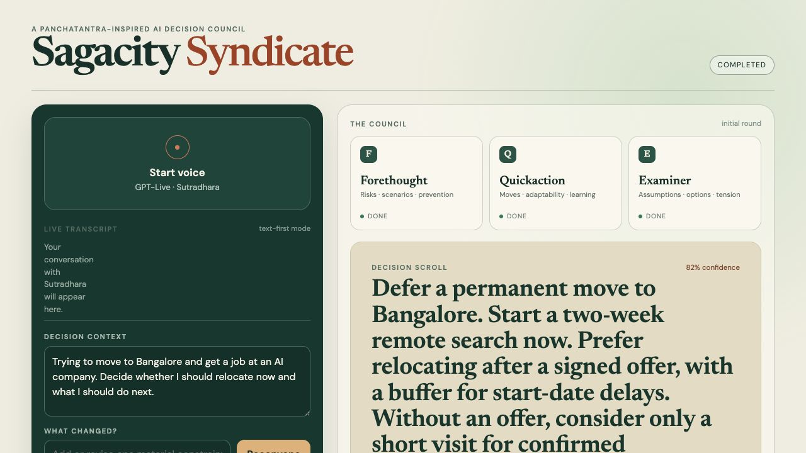

# Sagacity Syndicate

A small Panchatantra-inspired AI Decision Council. GPT-Live-1 plays Sutradhara, the conversational moderator, while three OpenAI Agents API specialists deliberate behind the scenes:

- **Forethought** — future risks, scenarios, prevention, second-order effects
- **Quickaction** — practical immediate moves, adaptability, low-regret action
- **Examiner** — assumptions, contradictions, and missing options

The agents analyze independently, cross-examine one another, and feed a bounded synthesis called the Decision Scroll. A separate Impact Router decides which perspectives must be rerun when a constraint changes.

## Documentation

- [Architecture Guide](ARCHITECTURE.md) — diagrams and implementation details for GPT-Live, client delegation, Agents API sessions, revision safety, and reconvening.
- [OpenAI Feature Matrix](FEATURE_MATRIX.md) — what GPT-Live and Agents API capabilities are used, missing, appropriate, or deliberately deferred, with implementation paths.
- [User Guide](USER_GUIDE.md) — practical voice and text workflows, result interpretation, follow-ups, privacy, and troubleshooting.
- [Test Plan](TEST_PLAN.md) — automated, mock, live Agents API, and real GPT-Live validation.
- [Live Voice Test Trail — 13 September 2026](docs/2026-09-13-live-voice-test-trail.md) — observed responses, lifecycle evidence, failures, corrective commits, and remaining live validation.
- [Live Acceptance Test Trail — 15 September 2026](docs/2026-09-15-live-acceptance-test-trail.md) — supervised end-to-end voice, interruption, reconvening, refresh, and exploration evidence.
- [Reliability and Voice-Correction Test Trail — 16 September 2026](docs/2026-09-16-reliability-test-trail.md) — server-restart hydration, pointer capture, Council Map integrity, transcript ambiguity, and the successful corrected revision.
- [Implementation Note](IMPLEMENTATION_NOTE.md) — the original failure analysis and chosen fix.



## Quick start

Requires Node.js 22.6 or later.

```bash
npm install
cp .env.example .env
npm run dev
```

Open [http://localhost:5173](http://localhost:5173). The default `.env.example` uses `MOCK_COUNCIL=true`, so the complete text-first flow works without an API key.

To use OpenAI:

```dotenv
OPENAI_API_KEY=your-project-key
MOCK_COUNCIL=false
OPENAI_LIVE_MODEL=gpt-live-1
OPENAI_COUNCIL_MODEL=gpt-6-astra
OPENAI_SYNTHESIS_MODEL=gpt-6-astra
```

Keep `.env` local. It is ignored by git and the API key is never sent to the browser. GPT-Live availability and Agents API access depend on the OpenAI project.

## Use

### Text-first

1. Enter the decision, objective, hard constraints, and time horizon.
2. Select **Convene the council**.
3. Watch each agent move through thinking, challenging, and done.
4. Add a changed constraint and select **Reconvene**. The Impact Router chooses the smallest adequate rerun set; ambiguity expands to all three agents.

### Voice

1. Configure a live API key and set `MOCK_COUNCIL=false`.
2. Select **Start voice** and allow microphone access.
3. Leave **Speak with Sutradhara** selected. The written Decision Context is optional in voice mode.
4. Hold the voice control while speaking, then release. The application assesses the completed turn and automatically starts the council when the decision is ready.
5. Native `session.delegation.created` is preferred. If GPT-Live does not emit it after a short grace period, an idempotent application fallback starts the same council path; no manual Convene click is required.
6. The full Decision Scroll appears in the UI; Sutradhara gives a short executive briefing rather than reading it aloud.
7. Ask “Why?”, ask for a specialist's view, or ask what would change the decision. These use the verified result without rerunning the council.
8. State a genuinely changed fact to reconvene. The previous verified Scroll remains visible until its replacement is complete.

Voice uses browser WebRTC. The server creates the `gpt-live-1` session with client delegation. The browser aggregates transcript fragments into `VoiceTurn` records. Because the current Live protocol does not expose a completed-input-transcript event, releasing push-to-talk initiates finalization; the acknowledged `session.input_audio.muted` boundary plus a short transcript-settle window closes the user turn. A late delta within that utterance updates the same turn instead of creating an interruption.

The delegation's `offset_ms` binds it to the user turn that caused it. That causal turn can never cancel its own council round. GPT-Live speech never changes application state: only native delegation, the readiness fallback, council events, and verified synthesis do. Only a later completed turn enters interruption materiality routing:

- acknowledgements, status questions, and questions about the completed decision preserve the round;
- confident changed constraints cancel/stale the active round and reconvene;
- ambiguous statements preserve work and prompt one brief clarification.

Push-to-talk also controls browser playback independently of council state. Pressing the control immediately suppresses Sutradhara audio, captures the active pointer so small movement outside the button cannot end the turn, keeps output suppressed through the user turn, and resumes only when a post-turn Sutradhara response begins. Recording stops once on deliberate release, browser cancellation, or lost pointer capture; the bounded `live.push_to_talk.stopped` diagnostic records which boundary occurred. Stopping speech never cancels council work by itself; only the completed-turn materiality path can invalidate a deliberation.

Spoken delivery and the durable artifact are deliberately different:

- **Decision Scroll** is the authoritative, complete, revision-checked UI result.
- **Council Map** is a bounded presentation trace showing each specialist's opening recommendation, critique direction, and the perspective that survived synthesis. Its **Detailed trail** view retains the denser audit presentation.
- **Voice Brief** is a deterministic, schema-bounded set of facts for roughly 20–40 seconds of natural paraphrase.
- `session.thinking.append` receives compact verified council context for later questions.
- `session.commentary.append` receives only the brief or concise process guidance intended to be spoken.
- All three Live append channels support the documented `delegation_id: null` session-context path, so fallback or text-started work can still report completion to an active voice session.

The transcript is a bounded, scrollable turn history. It follows new turns while the reader is at the bottom, preserves the reader's position after they scroll upward, and offers **Jump to latest**.

The newest authoritative Decision Scroll, its bounded Council Map trace, and its revisions survive a page refresh in local browser storage; raw transcript and original intake text do not. When voice reconnects after a refresh, the application immediately restores the verified Scroll as quiet GPT-Live context before accepting follow-up questions. If the server also restarted, a material change carries the prior Scroll into the Impact Router and performs one full council rebuild because provider sessions and complete specialist working state are not persisted. **Start a new decision** removes the saved record and resets the local session.

The browser also keeps a bounded history of the ten newest verified Scroll revisions. The **Decision workspace** can export any retained Scroll as Markdown and compares the initial and latest revision of the current decision field by field. Starting a new decision removes the current authoritative pointer but keeps this local history; **Clear older history** reduces it to the current Scroll. Neither store contains raw transcript, audio, or provider reasoning.

When Live is connected, the correction field remains available. Submitting a **Precise typed correction** adds one completed user turn to the visible transcript and enters the same revision-safe reconvening path as a material spoken correction. It is not sent as a second independent council request.

## Architecture

```text
Browser
  ├─ text UI ───────────────┐
  └─ GPT-Live WebRTC        │ fragments → completed turns → readiness → native delegation or fallback
                            ▼
Express server ── Council state machine
                    ├─ Voice materiality gate
                    ├─ Impact Router (reconvening only)
                    ├─ independent: Forethought | Quickaction | Examiner
                    ├─ cross-examination: selected agents in parallel
                    └─ synthesis: Decision Scroll
```

Key boundaries:

- `client/voice/` owns WebRTC, microphone tracks, Live events, and Live append channels.
- `server/agents/` adapts the current `openai` SDK Agents API session/stream interface.
- `server/orchestration/` owns order, concurrency, cancellation, revisions, and selective reconvening.
- `shared/schemas.ts` contains bounded Zod contracts for opinions, critiques, routing, events, and the final scroll.
- `shared/voice.ts` maps a verified Scroll to bounded quiet context and a Voice Brief; it never creates a second decision.
- `shared/voice-policy.ts` handles obvious non-material turns and high-confidence explicit changes such as deadlines, budgets, relocation limits, accepted offers, and removed options before using the bounded server-side materiality assessor.
- Completed user turns are processed serially, so a later short utterance cannot overtake an earlier material change while classification is in flight.
- `prompts/` keeps every role independently editable.

## Revisions and interruption

`conversationRevision` advances for each completed user turn or accepted text-context change. `deliberationRevision` advances only when a council run starts. Non-material conversation can therefore continue without invalidating council work. Results can be shown, added to quiet Live context, or spoken only when both revisions captured by that council round remain current.

A material interruption asks the server to cancel known active Agents API turns, aborts the local stream, and starts a newer revision. Late results are discarded before UI rendering and before either Live append channel, even if provider-side cancellation loses a race.

## State machine

```text
idle → clarifying → ready → [routing] → independent
  → cross_examining → synthesizing → completed

routing | independent | cross_examining | synthesizing → interrupted | failed
interrupted | failed → ready
```

The `routing` state appears only during reconvening. Agent-card states are projections of orchestration events, not locally inferred timers.

## Structured contracts

- Opinions: stance, 1–4 observations, recommendation, confidence, and up to three uncertainties.
- Critiques: critic, target agents, up to two agreements, 1–3 challenges, revision advice, and severity.
- Impact route: materiality, unique affected-agent subset, preserved fields, reason, and confidence.
- Decision Scroll: the seven required fields with explicit string limits and confidence from 0 to 1.
- Council trace: three bounded contributions plus at most six directed critique edges; it excludes observations, uncertainties, raw payloads, and chain-of-thought.
- Voice Brief: recommendation, reason, key tension, immediate next step, and optional reconvene trigger, with a 120-word hard ceiling.
- Voice interruption assessment: materiality, optional normalized changed constraint, bounded reason, and confidence.

The Agents API receives JSON Schema output constraints and the server validates again with Zod. Invalid output receives one repair turn, then fails visibly.

## Logging and privacy

Each orchestration transition and bounded agent result is appended to `logs/deliberations.jsonl`. The client/server Live lifecycle writes bounded event metadata to `logs/live-events.jsonl`, including turn boundaries, delegation binding, revisions, phases, append acknowledgements, cancellation, and stale-result suppression. It does not log API keys, audio, raw deltas, or chain-of-thought. These files are ignored by git and may still contain bounded decision facts; delete or redact them before sharing an archive.

Agents API runs additionally log stage and round latency, repair status, provider session IDs, and best-effort token usage. New provider sessions receive bounded trace metadata; cancellation events use stable idempotency keys. When an event stream fails after yielding a session ID, the runtime retrieves provider status before surfacing the uncertain failure rather than blindly retrying it.

The expandable **Diagnostics** drawer shows the current product mode, orchestration phase, revisions, projected agent states, shortened council ID, and the newest bounded browser lifecycle events. It deliberately omits transcript text, agent reasoning, API keys, and raw provider payloads. The JSONL logs remain the source for deeper local debugging.

Playback diagnostics include `live.playback.started`, `live.playback.suppressed`, `live.playback.resumed`, and `live.playback.stale_audio.discarded`. These describe browser control decisions, not proof of what a human actually heard.

For a voice debugging pass, run `npm run dev`, reproduce the issue, then inspect the two JSONL files. Look for `live.readiness.assessed`, followed by either `live.delegation.created` or `live.delegation.fallback`, then `council.started`. Completion should be followed by thinking, instructions, and commentary send/ack events. An append acknowledgement confirms GPT-Live accepted context; it does not prove the audio was spoken. Browser microphone, WebRTC, account entitlement, and audible playback still require a real-account smoke test.

## Commands

```bash
npm run dev        # Vite UI + Express server
npm run typecheck  # TypeScript project checks
npm test           # unit and orchestration tests
npm run build      # production client build
npm start          # serve production build on 127.0.0.1:8787
```

## Proof-of-concept limits

- Single local user; no authentication or database.
- Mock mode verifies UI and orchestration semantics, not OpenAI account access.
- Initial Agents API deliberation and Impact Router reconvening were live-tested on 2026-09-12. GPT-Live delegation, post-decision exploration, refresh persistence, explicit deadline reconvening, phase progress, playback suppression, and concise audible briefing were live-tested through 2026-09-15. The restart-safe `previousScroll` hydration path, pointer-capture boundary, decision-history persistence, and provider-generated Council Map were supervised with a real account on 2026-09-16. The provider-session recovery branch remains automated-test verified because the repaired live run did not encounter another broken stream.
- Transcript events are fragments and can contain recognition errors. Turn completion uses the strongest available push-to-talk event boundary, not linguistic guessing.
- A complete transcript can still contain a material recognition error such as “now” becoming “not.” A confirmation step for ambiguous high-impact corrections remains a recommended product improvement.

## Documentation baseline

The implementation follows the OpenAI documentation checked on 2026-09-12:

- [Getting started with GPT-Live](https://developers.openai.com/api/docs/guides/live)
- [GPT-Live client delegation](https://developers.openai.com/api/docs/guides/live-delegation?delegation-mode=client)
- [GPT-Live WebRTC](https://developers.openai.com/api/docs/guides/voice-webrtc?api=live)
- [Agents API quickstart](https://developers.openai.com/api/docs/guides/agents-api/quickstart)
- [Run and continue Agents API sessions](https://developers.openai.com/api/docs/guides/agents-api/sessions)
- [Agents API multi-agent guidance](https://developers.openai.com/api/docs/guides/agents-api/multi-agent)
